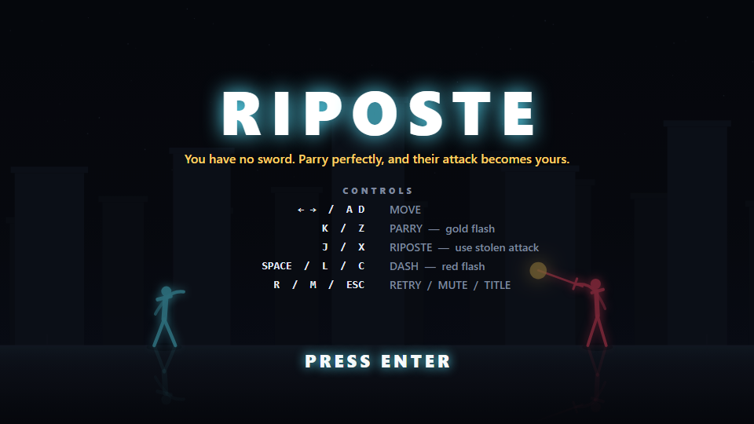
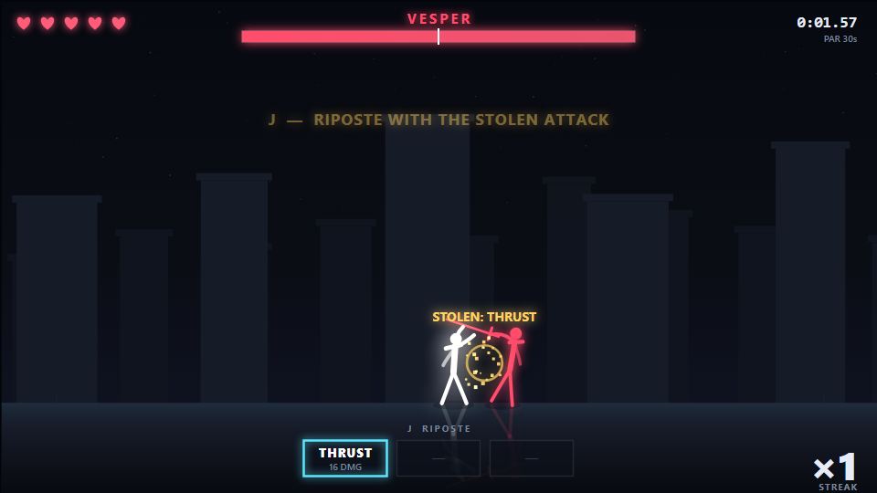
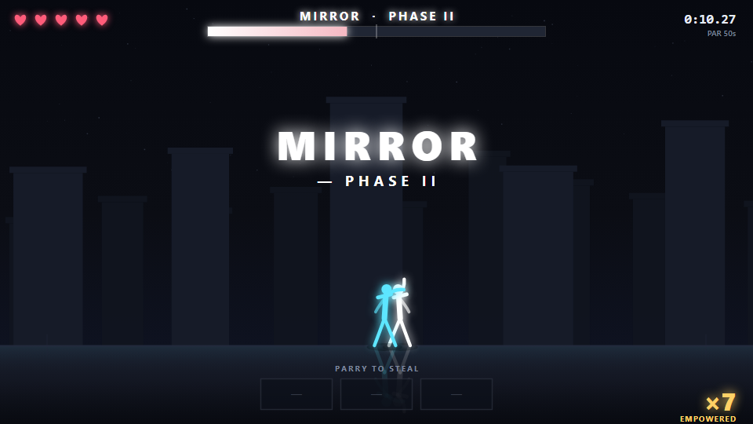
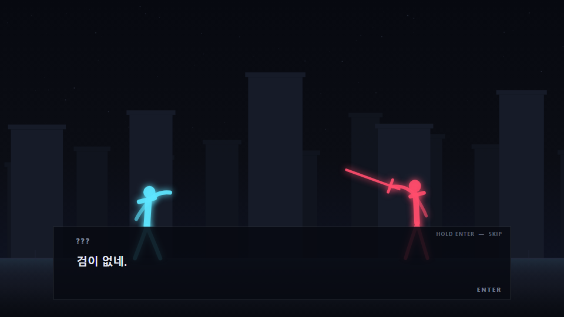

# RIPOSTE

### You have no sword. Parry perfectly, and their attack becomes yours.

**▶ Play in your browser: https://kkp8121-rgb.github.io/riposte/**

A side-view 1:1 boss-rush parry duel for keyboard, gamepad or touch. You start with **zero attacks**. Every
weapon in your hands was taken out of someone else's — a perfect parry doesn't just deflect
a strike, it *steals* it. Twelve bosses across three chapters: a mirror waits at the end of
chapter one to give everything back, a taker waits at the end of chapter two to take it all
first, and at the end of chapter three stands a wall that neither gives nor takes.



| A perfect parry steals the attack | The mirror turns your own hand on you |
|---|---|
|  |  |

---

## Controls

| Key | Gamepad | Action |
|---|---|---|
| `←` `→` / `A` `D` | Left stick / D-pad | Move |
| **`K`** / `Z` | **`X` / `□`** | **Parry** — answer the **gold** flash |
| **`J`** / `X` | **`Y` / `△`** | **Riposte** — spend a stolen attack |
| **`Space`** / `L` / `C` / `Shift` | **`B` / `○`, `RB`, `RT`** | **Dash** — i-frames; the only answer to **red** |
| `↑` `↓` / `W` `S` | Left stick / D-pad | Move the menu cursor |
| `Enter` | `A` / `×` | Confirm / start / next |
| `R` | `Select` | Retry current boss |
| `M` | — | Mute |
| `Esc` | `Start` | Back to title |

A gamepad is picked up as soon as you press a button on it, and keyboard keeps working at the
same time — nothing is polled until a pad actually connects.

**On a phone or tablet** (hold it sideways) on-screen buttons appear: ◀ ▶ to move on the left,
PARRY · RIPOSTE · DASH on the right, and OK / BACK in menus. RETRY and TITLE in a fight need a
half-second hold, so a stray thumb can't end the run. On a PC the buttons never show.

Two colors, two verbs. **Gold = parry. Red = dash.** That's the whole language — and the two
tells differ in *shape* as well as colour (gold bursts in eight rays, red in a thick X), so the
language still reads with the sound off or the colours hard to tell apart.

---

## How it plays

1. **Read the flash.** Every attack telegraphs with a burst at the weapon tip and an audio
   cue. The time from flash to impact is *constant per attack* — you learn a rhythm, not a
   reaction test.
2. **Parry on the beat.** A press opens a 0.18 s **perfect** window, then a 0.34 s **block**
   window. Perfect = no damage, the boss flinches, and the attack lands in your **hand**
   (3 slots, FIFO). Projectiles get reflected straight back. Block = safe but empty-handed.
   Whiff and you're wide open for 0.4 s.
3. **Riposte.** `J` spends the front slot. `lunge` stabs, `slash` sweeps, `shot` fires,
   `slam` crushes. Hit a boss **during its wind-up** and you interrupt it for **×1.5**.
4. **Keep the streak.** Three perfect parries in a row and every riposte deals **×2**. The
   streak only resets when *you* take damage — so the fantasy holds: flawless is lethal.
5. **Mind the stamina.** Parrying costs stamina, dashing costs less, and it refills a beat after
   you stop spending. What you get back follows how well you read: a **perfect** parry refunds
   the whole cost, a **block** half of it, a whiff nothing. Flawless reading is free, mashing is
   not. Run dry and the bar flashes red: the key simply won't answer.
6. **Phase II.** At 50 % HP every boss roars, speeds up its wind-ups, and unlocks new
   patterns.

Rank per boss: **S** = no hits *and* under par · **A** = ≤1 hit *or* under par ·
**B** = ≤3 hits · **C** = otherwise.

The victory card also counts your tries on each boss and remembers your best.

---

## The bosses

| # | Boss | | What it teaches | What you take |
|---|---|---|---|---|
| — | **CHAPTER I — THE HAND** | | | |
| 1 | **VESPER** | *The Duelist* | The parry itself. Opens slowly, flashes unmistakably. | `THRUST` `SLASH` |
| 2 | **SERAPH** | *The Archer* | Reading projectiles and reflecting them. Keeps its distance. | `ARROW` `KICK` |
| 3 | **GRAVEN** | *The Bulwark* | Armor — only an **empowered** riposte interrupts it. Dash *into* the charge. | `SLAM` `SHOCKWAVE` |
| 4 | **MIRROR** | *Your Reflection* | Patience. It feints, and in Phase II it replays **your own hand** back at you. | everything |
| — | **CHAPTER II — THE DEBT** | | | |
| 5 | **LANTERN** | *The Illusionist* | Reading the colour — and the direction: it blinks behind you, and a shot you dodge red comes home gold from over your shoulder. | `FLICKER` `ORB` |
| 6 | **CHORUS** | *The Twin Blades* | Chained parries while it crosses to your other side — a rhythm called once and answered from memory, and an echo that strikes again from where it stood. | `TWIN` `CANON` |
| 7 | **BASTION** | *The Warden* | Armor, a pillar at your back that seals retreat, and it bats your reflected shots back — strike the recovery. | `VOLLEY` |
| 8 | **AVARICE** | *The Taker* | It has no moves of its own — it pulls you in, and every hit you take, it takes a card and uses it. | `COUNT` `HAUL` + everything |
| — | **CHAPTER III — THE WALL** | | | |
| 9 | **SENTINEL** | *The Spear* | It never moves. Red zones eat the floor from the edges in, and a beam sweeps the lane from behind you — dash into it, not away. The room shrinks, and dashing becomes a resource. | `LANCE` |
| 10 | **TEMPEST** | *The Rain* | Volume, and a pincer that comes front and back on a timer — parry ahead, then spin and dash what's behind you before you can catch it all. | `SURGE` `SQUALL` |
| 11 | **HOLLOW** | *The Dark* | The arena goes dark and a mark burns onto you — read your own countdown, not the boss, while another attack lands on top of it. | `BRAND` `EMBER` |
| 12 | **ADAMANT** | *The Wall* | A wall only your **reflected** shots can break — break it and it staggers wide open. A guard stance punishes an early hit, so you wait for the strike at the end. In Phase II only a **counter** hurts it. | `CLEAVE` `SHARD` |

---

## Between fights

Every boss opens and closes with a short scene — four lines or fewer, in Korean, first line
always an unlabeled `???`. Three of them put a choice in your mouth: `K` to parry, `J` to
riposte, and the wrong answer earns a `TAKEN.` card before the same choice comes back around.
Retry a boss with `R` and the scene doesn't play again — only your first attempt sees it.
`?story=0` skips every line if you just want the fights.



---

## RIPOSTE+

Clear the ending once and the title menu gains **NEW RUN (RIPOSTE+)**: every boss winds up
faster, throws patterns closer together, and roars into Phase II at 60 % health instead of 50 %.
No new bosses, no new attacks — the same twelve fights, played at speed. Its records are kept
apart from your normal ones and ranks carry a `+`.

---

## Options

The title screen is a menu: **NEW RUN**, **CONTINUE**, **BOSS SELECT** (bosses you have cleared),
**OPTIONS**. Options cover master volume, fullscreen, the screen flash and particles, full key
rebinding, and two **assist** sliders — more player HP, slower boss wind-ups.

Assist is opt-in and the defaults change nothing. Turn either slider off default and that run
stops writing ranks and best records; the victory card says so. The fight itself is never made
easier behind your back.

---

## Tech notes

- **Vanilla JavaScript + Canvas 2D.** No framework, no build step, no bundler.
- **Zero external assets.** No CDN, no web fonts, no image or audio files. Every sound is
  synthesised live in WebAudio; every character is a vector silhouette with procedural
  animation (breathing bob, movement lean, weapon-arc glow, dash after-images).
- Classic `<script>` tags, so it runs straight off `file://` *and* from a GitHub Pages
  sub-path. All paths are relative.
- Logical resolution 960×540, letterboxed to the window with device-pixel-ratio scaling.
  Fixed-step simulation at 1/120 s with an accumulator; rendering on `requestAnimationFrame`.
- Deterministic: boss pattern selection and deflect chance are the only consumers of RNG,
  and it's seeded.
- Five arenas, drawn not loaded: the pillars, palette and floor change per boss out of a table,
  and each boss carries its own drone — wave, base note, filter — that shifts when Phase II hits.
- Constants live in tables — `js/config.js` globally, `js/bosses/*.js` per boss. No magic
  numbers in the logic.

### URL parameters

| Param | Effect |
|---|---|
| `?boss=1..12` | Jump straight to a boss (skips its story scene too) |
| `?story=0` | Skip every story scene |
| `?seed=N` | Seed the pattern RNG |
| `?mute=1` | Start muted |
| `?nofx=1` | Disable particles, rings, after-images and text pops. **Hit-stop, screen shake and slow-motion stay on** — they are part of the timing, not decoration, so judgement is identical with or without it |
| `?flash=0` | Disable the full-screen white flash on a perfect parry (photosensitivity opt-out). Hit-stop, shake, slow-motion and the tell bursts all stay on |
| `?hard=1` | Start in **RIPOSTE+** (harder wind-ups, tighter patterns, Phase II at 60 % HP) |
| `?speed=0.5` | Time scale |

A run started with `?boss=N` never writes to your saved progress.

### Run it locally

```
open index.html
```

That's it — double-click the file. No server needed.

### Tests

```
npm install                 # playwright-core, once

node tests/smoke.mjs        # headless boot, title -> story -> fight, 60s idle -> defeat, 0 page errors
node tests/bot.mjs --all    # a reactive bot beats all twelve bosses; a passive bot loses
node tests/state.mjs        # boss definition tables stay byte-identical across a whole fight
node tests/audio-smoke.mjs  # one keypress -> AudioContext running; every sound path callable
node tests/story.mjs        # dialogue table rules: line/length limits, choice shape
node tests/mash.mjs --all --riposte --expect-lose   # a bot that only mashes must lose every fight
node tests/pad.mjs          # gamepad mapping via a mocked pad: buttons, stick, no stuck keys
node tests/options.mjs      # options menu: volume, assist, rebinding, reset, boss select
node tests/zone.mjs         # persistent zone (linger) behavior: one-shot zones unchanged, linger zones re-strike on tick
node tests/touch.mjs        # touch controls: phone vs PC detection, multi-touch, per-screen buttons, portrait pause
node tools/boss-overlap.mjs --check  # boss differentiation gate: no undeclared pattern/attack overlap
node tools/shots.mjs        # re-capture the README screenshots into docs/media/
```

All but `story.mjs` (a plain Node check of the dialogue table) use `playwright-core` with the
bundled Chromium and drive the game through the debug hook `window.__RIPOSTE`. Test
screenshots land in `tests/shots/`.

---

## Credits

Built for a game jam. Design, code, audio synthesis and art direction are all in this repo —
`docs/superpowers/specs/2026-09-09-riposte-design.md` is the full design document.

*Nothing is given. Everything is taken. Nothing is kept. Nothing is left to take.*
